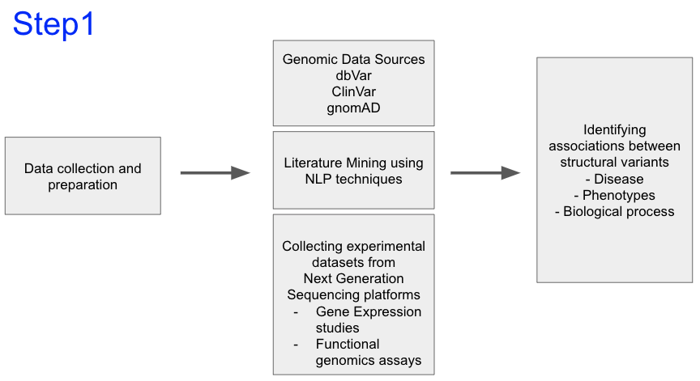
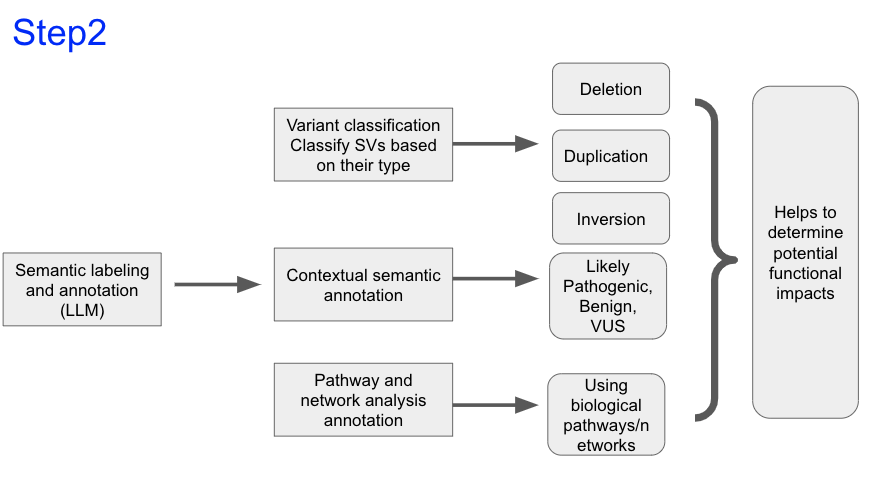

# LLM_SVs

# Semantic Labeling of Structural Variants using LLM

## Structural variants 
```
Deletions : Loss of a segment of DNA
Duplications: Repeated segments of DNA
Inversions: Reversal of segment of DNA
Translocations: Movement of DNA segments between non-homologous chromosomes
Insertions: Addition of foreign DNA segments
```

## Potential Workflow
```
Input: A VCF file with structural variant calls
Processing: Extract relevant information (type, location, impact)
LLM interaction: Pass the extracted information to the LLM to generate descriptions and labels
Output: Annotated SV data with semantic descriptions, classification and potential implications
```






## Contributors:
```
1) Ramanandan Prabhakaran
2) Karolis
3) Veena Ghorakvai
4) Anika Pal
```
